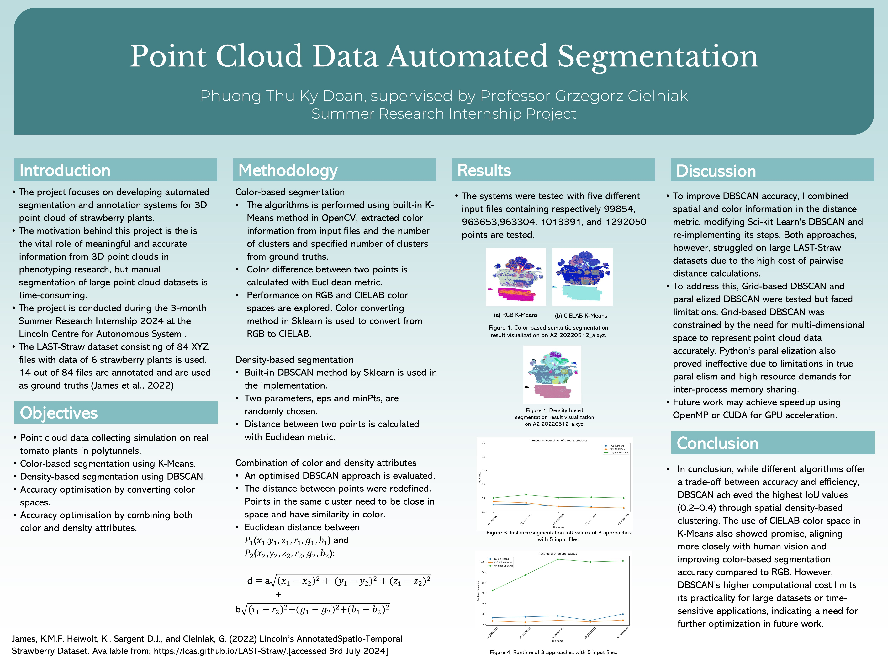

#3D-Point-Cloud-Automated-Segmentation

[LAST-Straw Dataset](https://lcas.github.io/LAST-Straw/) contains point clouds of 6 strawberry plants, each captured 14 times over the span of 11 weeks (13/05/2022 - 29/07/2022). The 6 plants are of two varieties, Driscoll's Katrina (variety A) and Driscoll's Zara (variety B), with three individuals of each. A total of 84 point clouds are provided with an average of over 1.17 million points per scan. Of these, 28 are annotated with class and instance labels for each point in the cloud.

This project uses Numpy version 1.23.5 and Open3D version 0.18.0.
NOTE: Open3D is not compatible with some new Numpy versions.
